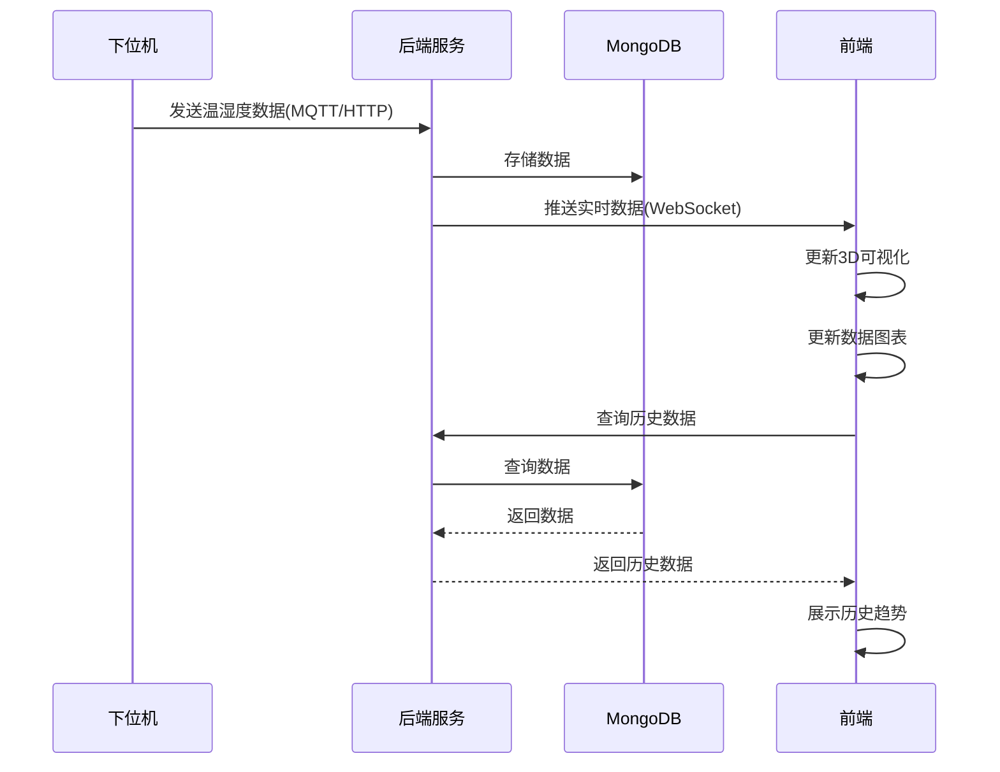

# 机房温湿度数字孪生系统

## 项目简介

本项目是一个基于数字孪生技术的机房温湿度监控系统，通过实时采集、处理和可视化机房内的温湿度数据，实现对机房环境的全方位监控和管理。

## 系统架构

### 1. 数据采集层
- 接收下位机发送的温湿度数据
- 支持多种传输协议：MQTT、HTTP、WebSocket
- 数据格式：JSON

### 2. 数据处理层
- 实时数据处理和存储
- 历史数据查询和分析
- 异常数据检测和告警

### 3. 可视化层
- 3D机房环境展示
- 温湿度实时监控
- 设备状态可视化
- 历史数据趋势分析

### 4. 实时更新机制
- WebSocket实时数据推送
- 数据同步和状态更新

## 技术栈

### 前端
- Vue 3 + TypeScript
- Three.js（3D可视化）
- ECharts（数据图表）
- Socket.io-client（实时通信）
- Vite（构建工具）

### 后端
- Node.js + Express
- MQTT.js（MQTT客户端）
- MongoDB（数据存储）
- Socket.io（实时通信）
- CORS（跨域支持）

## 项目结构

```
DataCenter_DT/
├── frontend/          # 前端项目
│   ├── package.json   # 前端依赖配置
│   ├── tsconfig.json  # TypeScript配置
│   ├── vite.config.ts # Vite构建配置
│   ├── public/        # 静态资源
│   └── src/           # 源代码
│       ├── assets/    # 资源文件
│       ├── components/ # 组件
│       ├── views/     # 页面
│       ├── services/  # 服务
│       └── main.ts    # 入口文件
├── backend/           # 后端项目
│   ├── package.json   # 后端依赖配置
│   ├── tsconfig.json  # TypeScript配置
│   └── src/           # 源代码
│       ├── controllers/ # 控制器
│       ├── models/    # 数据模型
│       ├── services/  # 服务
│       └── index.ts   # 入口文件
└── README.md          # 项目说明
```

## 前端架构

### 核心组件
- **3D可视化组件**：基于Three.js实现机房环境的3D展示
- **数据监控组件**：实时展示温湿度数据和设备状态
- **图表分析组件**：基于ECharts实现历史数据趋势分析
- **告警组件**：展示异常数据告警信息

### 服务模块
- **WebSocket服务**：与后端建立实时通信连接
- **数据服务**：处理数据的获取、转换和存储
- **3D渲染服务**：负责3D场景的构建和渲染

## 后端架构

### 核心模块
- **数据采集模块**：接收和处理来自下位机的数据
- **数据存储模块**：将数据存储到MongoDB数据库
- **WebSocket模块**：向前端推送实时数据
- **MQTT客户端**：订阅和处理MQTT消息

### API接口
- **数据查询接口**：提供历史数据的查询服务
- **设备管理接口**：管理设备信息和状态
- **告警配置接口**：配置异常数据的告警规则

## 数据格式

### 下位机发送的数据格式
```json
{
  "deviceId": "device-001",
  "timestamp": 1620000000000,
  "temperature": 25.5,
  "humidity": 60.2,
  "status": "normal"
}
```

### 系统存储的数据格式
```json
{
  "_id": "mongodb-id",
  "deviceId": "device-001",
  "timestamp": 1620000000000,
  "temperature": 25.5,
  "humidity": 60.2,
  "status": "normal",
  "createdAt": "2021-05-03T00:00:00.000Z"
}
```

## 功能特性

- **实时温湿度监控**：实时展示机房内的温湿度数据
- **3D机房环境可视化**：通过3D模型直观展示机房环境
- **历史数据趋势分析**：通过图表展示历史数据变化趋势
- **异常数据告警**：当温湿度超出阈值时产生告警
- **设备状态管理**：监控和管理设备的运行状态
- **多设备支持**：支持同时监控多个温湿度设备

## 扩展能力

- **支持添加更多传感器类型**：可扩展支持其他类型的传感器数据
- **支持多机房管理**：可扩展为多机房的集中监控系统
- **支持与其他系统集成**：提供API接口与其他系统集成
- **支持移动端访问**：可扩展为支持移动端访问的响应式设计

## 部署步骤

### 1. 安装依赖

#### 前端依赖
```bash
cd frontend
npm install
```

#### 后端依赖
```bash
cd backend
npm install
```

### 2. 配置环境变量

在后端项目中创建`.env`文件，配置MongoDB连接信息和其他环境变量：

```env
# MongoDB连接信息
MONGODB_URI=mongodb://localhost:27017/datacenter-dt

# 服务端口
PORT=3000

# MQTT配置
MQTT_BROKER=mqtt://localhost:1883
MQTT_TOPIC=datacenter/sensors
```

### 3. 启动服务

#### 启动后端服务
```bash
cd backend
npm run dev
```

#### 启动前端服务
```bash
cd frontend
npm run dev
```

### 4. 访问系统界面

前端服务启动后，在浏览器中访问：`http://localhost:5173`

## 开发指南

### 前端开发
- 使用Vue 3的组合式API进行组件开发
- 使用TypeScript确保类型安全
- 使用Three.js构建3D场景
- 使用ECharts实现数据可视化

### 后端开发
- 使用Express框架构建RESTful API
- 使用Mongoose操作MongoDB数据库
- 使用Socket.io实现实时通信
- 使用MQTT.js处理MQTT消息

## 技术选型说明

### 前端技术选型
- **Vue 3**：采用最新的组合式API，提供更好的TypeScript支持和性能优化
- **Three.js**：轻量级3D库，适合构建简单的3D可视化场景
- **ECharts**：功能强大的图表库，适合展示各种数据图表
- **Socket.io-client**：实现与后端的实时通信
- **Vite**：快速的前端构建工具，提供更好的开发体验

### 后端技术选型
- **Node.js**：轻量级的JavaScript运行时，适合构建实时应用
- **Express**：简洁高效的Web框架，适合构建RESTful API
- **MongoDB**：文档型数据库，适合存储和查询传感器数据
- **MQTT.js**：轻量级的MQTT客户端，适合处理物联网设备数据
- **Socket.io**：实现与前端的实时通信

## 系统流程图



## 监控指标

### 温度监控
- **正常范围**：18-27°C
- **告警阈值**：>30°C或<15°C

### 湿度监控
- **正常范围**：40-60%
- **告警阈值**：>70%或<30%

## 总结

本项目采用前后端分离的架构设计，前端负责数据可视化和用户交互，后端负责数据采集、处理和存储。通过数字孪生技术，实现了机房环境的实时监控和3D可视化，为机房的管理和维护提供了直观、高效的工具。

系统具有良好的扩展性，可以根据需要添加更多的传感器类型和功能模块，满足不同场景下的需求。